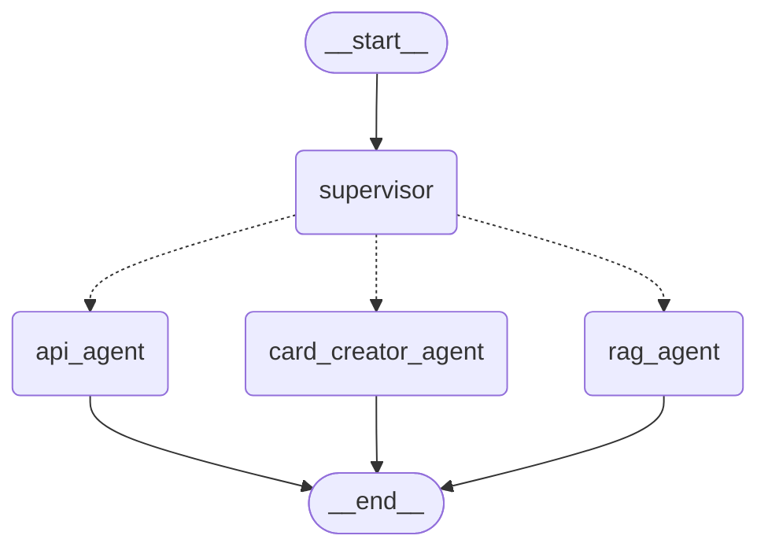

<<<<<<< HEAD
# turingtech
=======
# Chatbot MTG — Demo (LangGraph + Groq + RAG)

Demo funcional de un chatbot para el call center de Magic: The Gathering,
capaz de resolver dudas de reglas, interacciones entre cartas, búsqueda de
cartas por descripción y (bonus) creación de cartas custom.

Para la solución de producción completa (servicios, monitorización,
escalabilidad, etc.) ver **`docs/arquitectura.md`**.

## Arquitectura de la demo

Un **supervisor** clasifica la intención del usuario y enruta la
conversación (patrón *handoff* con `Command(goto=...)` de LangGraph) a uno
de tres agentes especializados, cada uno construido con
`create_react_agent` (agente ReAct pre-construido de `langgraph.prebuilt`):



*(Diagrama generado directamente desde el grafo real con `app.get_graph().draw_mermaid()`)*

| Agente | Requerimiento que cubre | Tools |
|---|---|---|
| `rag_agent` | Reglas básicas + interacciones entre cartas | `search_mtg_rules` (RAG sobre el reglamento) |
| `api_agent` | Búsqueda de cartas por descripción, novedades | `search_cards`, `get_card_by_name`, `get_recent_sets` (API magicthegathering.io) |
| `card_creator_agent` | (Bonus) Creación de cartas custom | `search_cards`, `get_card_by_name` (como referencia de balance) |

No se usa MCP: todas las tools son funciones Python estándar decoradas con
`@tool` (API) o un retriever envuelto con `create_retriever_tool` (RAG),
ambos mecanismos nativos de LangChain/LangGraph. MCP habría añadido un
proceso adicional y complejidad de despliegue sin aportar nada que estas
tools no resuelvan ya — se reserva para cuando haya que integrar un
sistema de terceros que ya exponga un servidor MCP propio.

## Estructura del proyecto

```
mtg-chatbot/
├── data/
│   └── reglamento_demo.md      # Extracto de reglas de ejemplo (ver nota abajo)
├── rag/
│   ├── ingest.py                # Indexado del reglamento en FAISS
│   └── index/                   # (generado) índice vectorial local
├── tools/
│   ├── rag_tools.py              # Tool de búsqueda semántica sobre el reglamento
│   └── mtg_api_tools.py          # Tools sobre la API de magicthegathering.io
├── agents/
│   └── specialists.py            # Construcción de los 3 agentes (create_react_agent)
├── graph/
│   └── supervisor.py             # Grafo supervisor (router + handoff)
├── main.py                       # CLI de demo
└── requirements.txt
```

## Instalación

```bash
pip install -r requirements.txt
export GROQ_API_KEY="tu_api_key"          # https://console.groq.com
```
$env:GROQ_API_KEY = "your-api-key-here" (powershell)

## Indexar el reglamento (RAG)

La demo incluye un extracto reducido de reglas (`data/reglamento_demo.md`)
para poder probar el pipeline sin depender del PDF oficial. Indícalo así:

```bash
python -m rag.ingest --source data/reglamento_demo.md
```

Esto descarga (la primera vez) el modelo de embeddings local
`sentence-transformers/all-MiniLM-L6-v2` y genera el índice FAISS en
`rag/index/`.

### Sustituir el reglamento por el oficial

Cuando tengas el PDF con el reglamento completo (Comprehensive Rules):

```bash
python -m rag.ingest --source /ruta/a/reglamento_oficial.pdf
```

Esto regenera el índice completo. No hace falta cambiar nada más del
código — el resto del pipeline es agnóstico al contenido indexado.

## Ejecutar la demo

```bash
python main.py
```

Ejemplos de preguntas a probar:

```
¿Qué fases hay en un turno de juego?
¿Cómo funciona el mana pool?
Mi criatura con daño primero ha hecho daño primero, si cambio su control con un efecto antes del paso de daño regular, ¿vuelve a hacer daño?
Busco una carta de color blanco de coste inferior a dos de mana que sea guerrero
¿Cuáles son los últimos sets que han salido?
Quiero una carta de Han Solo, blanca-roja, que tenga daño primero
```

## Notas de diseño relevantes

- **Groq como LLM**: se eligió por su baja latencia (motor LPU), clave para
  un chatbot de atención en tiempo real en un call center. Modelo por
  defecto: `llama-3.3-70b-versatile` (configurable con la variable de
  entorno `GROQ_MODEL`).
- **Embeddings locales**: se usa un modelo local de HuggingFace
  (`sentence-transformers`) para no depender de una API de embeddings de
  pago en la demo. En producción se recomienda un servicio de embeddings
  gestionado y un vector store dedicado — ver `docs/arquitectura.md`.
- **Router con salida estructurada**: el supervisor usa
  `llm.with_structured_output(RouteDecision)` (Pydantic) en vez de parsear
  texto libre, para que el enrutado sea fiable y fácil de testear.
- **Grounding obligatorio**: el prompt del `rag_agent` obliga a llamar
  siempre a `search_mtg_rules` antes de responder y a citar el fragmento
  del reglamento usado, y el `card_creator_agent` debe apoyarse en cartas
  reales (vía `api_agent` tools) antes de proponer estadísticas de balance.
  Esto no garantiza que la respuesta sea correcta, pero sí que sea
  trazable/justificable, tal como pide el enunciado.

## Limitaciones conocidas de la demo

- El extracto de reglas es reducido: preguntas fuera de las 6 secciones
  cubiertas (turno, maná, pila, daño primero/doble, cambio de controlador,
  acciones basadas en estado) no tendrán buen contexto hasta indexar el
  reglamento oficial completo.
- La API pública de magicthegathering.io no soporta filtrar directamente
  por rango de coste de maná ni por combinaciones complejas de color; la
  tool `search_cards` filtra el CMC sobre los resultados ya devueltos por
  la API, lo que puede dar menos resultados de los reales si la página de
  resultados es pequeña (ver `page_size`).
- No hay memoria persistente entre sesiones ni checkpointing (LangGraph
  soporta ambos de forma nativa — ver sección de producción en
  `docs/arquitectura.md`).
>>>>>>> 2cef484 (second commit)
