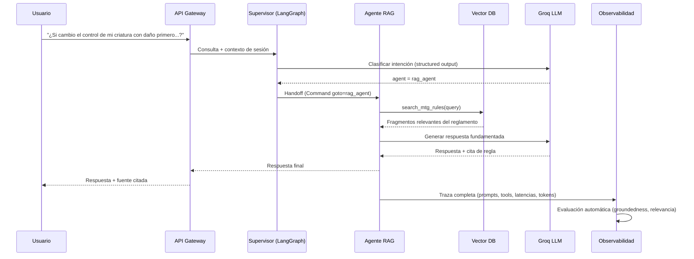

# Solución productiva — Chatbot de atención al cliente para Magic: The Gathering

**Cliente:** Call center de resolución de dudas y consejos de Magic: The Gathering
**Documento:** Propuesta de arquitectura de solución productiva
**Alcance:** Automatización de la resolución de dudas de reglas, interacciones
entre cartas, búsqueda de cartas y creación de cartas custom mediante un
chatbot basado en agentes LLM.

---

## 1. Resumen ejecutivo

Se propone un chatbot multi-agente orquestado con **LangGraph**, que combina:

- Un sistema de **RAG** (Retrieval-Augmented Generation) sobre el reglamento
  oficial del juego, para dudas de reglas e interacciones entre cartas.
- Un **agente con herramientas** sobre la API de magicthegathering.io, para
  búsqueda de cartas y consulta de novedades/imágenes.
- Un **agente creador de cartas custom** (bonus), que combina generación
  creativa del LLM con referencias reales de cartas existentes para mantener
  el balance de juego.
- Un **agente supervisor** que enruta cada consulta al agente adecuado.

El LLM de inferencia es **Groq** (motor LPU), elegido por su latencia muy
baja, factor crítico en un chatbot de atención en tiempo real donde el
cliente espera una respuesta inmediata (sustituyendo o apoyando a un agente
humano de call center).

La solución se diseña para desplegarse como un conjunto de **microservicios
independientes** (orquestador de agentes, servicio de ingesta/RAG, gateway de
API), con observabilidad de extremo a extremo, evaluación continua de
calidad de las respuestas y un mecanismo de **escalado a agente humano**
cuando el sistema no tiene confianza suficiente en la respuesta — algo
especialmente importante en un dominio (reglas de un juego competitivo)
donde una respuesta incorrecta tiene coste real para el cliente.

## 2. Objetivos y alcance funcional

| Requerimiento | Componente responsable |
|---|---|
| Dudas de reglas básicas (fases del turno, maná, etc.) | Agente RAG sobre reglamento |
| Interacciones entre cartas | Agente RAG sobre reglamento (+ contexto de cartas vía agente API si es necesario) |
| Búsqueda de cartas según descripción | Agente API (magicthegathering.io) |
| (Bonus) Creación de cartas custom | Agente creador, apoyado en el agente API para referencias de balance |
| Enrutado de la conversación | Agente supervisor |

Fuera de alcance explícito de este documento (pero señalado como mejora
futura en la sección 9): autenticación de usuarios finales, integración con
el CRM del call center, y soporte multi-idioma más allá de español/inglés.

## 3. Arquitectura general

### 3.1 Vista de componentes

```mermaid
flowchart TB
    subgraph Canal["Canales de entrada"]
        WEB[Chat web / app]
        TEL[Integración telefonía\n(IVR / voz a texto)]
        CRM[Panel del agente humano\ndel call center]
    end

    subgraph Edge["Capa de entrada"]
        GW["API Gateway\n(auth, rate limiting, WAF)"]
    end

    subgraph Orq["Servicio de orquestación (LangGraph)"]
        SUP[Agente Supervisor / Router]
        RAG[Agente RAG\nreglas e interacciones]
        API[Agente API\nbúsqueda de cartas y novedades]
        CREA[Agente Creador\ncartas custom]
        SUP --> RAG
        SUP --> API
        SUP --> CREA
        CREA -.usa como tool.-> API
    end

    subgraph Datos["Capa de datos"]
        VDB[(Vector DB\nreglamento indexado)]
        CACHE[(Cache Redis\nrespuestas API / sesión)]
        CKPT[(Checkpointer\nLangGraph - historial conversación)]
    end

    subgraph Externo["Servicios externos"]
        GROQ[Groq API\nLLM inferencia]
        MTGAPI[magicthegathering.io\nAPI de cartas]
    end

    subgraph Obs["Observabilidad"]
        TRACE[LangSmith / OTel\ntracing de agentes]
        METR[Métricas y dashboards]
        EVAL[Pipeline de evaluación\ny detección de deriva]
        ALERT[Alertas]
    end

    WEB --> GW
    TEL --> GW
    GW --> SUP
    CRM -.consulta trazas / escalado.-> Obs

    RAG --> VDB
    RAG --> GROQ
    API --> MTGAPI
    API --> CACHE
    CREA --> GROQ
    SUP --> GROQ
    SUP --> CKPT

    Orq --> TRACE --> METR --> ALERT
    TRACE --> EVAL
```

### 3.2 Vista de secuencia de una consulta típica



Continúa en las siguientes secciones: componentes en detalle (§4), servicios
y despliegue (§5), monitorización (§6), seguridad (§7), escalabilidad y alta
disponibilidad (§8) y roadmap (§9).

## 4. Componentes en detalle

### 4.1 Agente Supervisor / Router

**Responsabilidad:** clasificar la intención de cada mensaje del usuario y
enrutarlo al agente especializado adecuado, manteniendo el estado de la
conversación (historial de mensajes) entre turnos.

**Diseño:**
- Implementado como nodo de un `StateGraph` de LangGraph, usando el patrón
  de *handoff* (`Command(goto=...)`) — patrón nativo de LangGraph para
  arquitecturas supervisor/multi-agente, sin necesidad de infraestructura
  adicional (MCP, colas de mensajes, etc.).
- Clasificación mediante **salida estructurada** (`with_structured_output`
  sobre un modelo Pydantic con las categorías posibles), en vez de parseo de
  texto libre — más fiable, testeable y con menor superficie de error que un
  prompt de "responde con una palabra".
- En producción, este nodo también decide si:
  - la conversación requiere **desambiguación** (pedir una aclaración al
    usuario antes de enrutar, p. ej. si la intención es ambigua entre reglas
    y búsqueda de cartas);
  - la conversación debe **escalarse a un agente humano** (ver §4.5).

### 4.2 Agente RAG (reglas e interacciones)

**Responsabilidad:** responder dudas de reglas básicas e interacciones entre
cartas, con respuestas fundamentadas y citables.

**Pipeline RAG:**
1. **Ingesta (offline / batch):** el reglamento oficial (Comprehensive
   Rules) se trocea con una estrategia de *chunking* que respeta la
   estructura jerárquica del documento (capítulos → reglas → subreglas,
   p. ej. la numeración oficial 508.1a, 508.1b...), preservando el número de
   regla como metadata de cada fragmento. Esto permite citar la regla exacta
   en la respuesta, no solo un fragmento de texto.
2. **Embeddings:** en producción se recomienda un modelo de embeddings
   gestionado (p. ej. Voyage AI, recomendado por Anthropic para RAG con
   Claude, u OpenAI `text-embedding-3`) en vez del modelo local usado en la
   demo, por mejor calidad de recuperación y sin gestionar infraestructura
   de GPU propia.
3. **Vector store:** un vector DB gestionado (Pinecone, Weaviate Cloud, o
   `pgvector` sobre PostgreSQL si se prefiere mantener la pila de datos
   unificada) en vez de un índice FAISS local en fichero — necesario para
   alta disponibilidad, actualizaciones sin downtime (p. ej. cuando salga
   una actualización del reglamento) y escalado horizontal del servicio de
   orquestación sin duplicar el índice en cada réplica.
4. **Recuperación híbrida:** combinar búsqueda semántica (embeddings) con
   búsqueda léxica (BM25 / full-text) mejora la recuperación de reglas que
   se citan por número exacto (p. ej. "regla 702.7") o por términos muy
   específicos del reglamento donde la búsqueda semántica pura puede fallar.
5. **Generación:** el LLM (Groq) recibe los fragmentos recuperados y genera
   la respuesta con instrucción explícita de citar la regla de origen.

**Tool expuesta al agente:** `search_mtg_rules` (ver demo,
`create_retriever_tool`), ejecutada dentro del propio proceso del agente —
no requiere MCP porque es una función Python nativa sobre el vector store.

**Interacciones entre cartas:** para preguntas que mencionan cartas
concretas (p. ej. nombres de criaturas), el agente RAG puede además invocar
la tool `get_card_by_name` del agente API (ver diseño de *tools
compartidas* en §4.4) para obtener el texto de reglas exacto de esas cartas
antes de razonar sobre la interacción, en lugar de depender de que el LLM
"recuerde" el texto de la carta.

### 4.3 Agente API (búsqueda de cartas y novedades)

**Responsabilidad:** traducir una descripción en lenguaje natural a una
consulta estructurada contra la API de magicthegathering.io, y presentar los
resultados (incluyendo imagen de la carta).

**Diseño:**
- Tools nativas de LangChain (`@tool`) que llaman a la API REST pública, con
  timeout, manejo de errores y reintentos con backoff exponencial.
- **Caché (Redis)** delante de la API externa: las búsquedas de cartas son
  altamente repetitivas (muchos usuarios preguntan por las mismas cartas
  populares) y la API pública no ofrece SLA — cachear reduce la latencia
  percibida y la dependencia de disponibilidad del tercero.
- **Circuit breaker**: si la API externa falla repetidamente, el agente debe
  degradar con gracia (responder que el servicio de búsqueda no está
  disponible temporalmente y ofrecer escalar a un humano) en vez de
  reintentar indefinidamente o alucinar una respuesta.
- Nota de robustez: la API pública de magicthegathering.io no tiene garantía
  de disponibilidad ni SLA. Para producción se recomienda evaluar una fuente
  de datos de cartas más robusta (Scryfall API, que sí ofrece bulk data
  descargable e indexable localmente) como alternativa o complemento, y
  Scryfall permite tener un espejo propio actualizado periódicamente en vez
  de depender de disponibilidad en tiempo real de un tercero para cada
  consulta.

### 4.4 Agente creador de cartas custom (bonus)

**Responsabilidad:** generar cartas originales balanceadas y con formato
correcto (coste de maná, tipo, texto de reglas con nomenclatura oficial).

**Diseño:**
- Usa las mismas tools del agente API como *tools compartidas* (patrón
  habitual en LangGraph: una tool puede registrarse en varios agentes) para
  obtener 1-3 cartas reales similares como referencia de balance antes de
  proponer estadísticas — evita que el LLM invente un balance de poder
  irreal sin anclaje a cartas existentes.
- Temperatura más alta que el resto de agentes (creatividad), pero manteniendo
  salida en un **formato estructurado** (Pydantic: nombre, coste, tipo,
  texto de reglas, P/T, flavor text, justificación) para poder renderizar la
  carta con una plantilla visual consistente en el canal del cliente.
- Mejora futura: generación de la imagen de la carta con un modelo de
  imagen, y validación automática del texto de reglas generado contra el
  glosario oficial de habilidades con la propia tool de RAG (evitar que
  invente nombres de habilidades que no existen en el juego).

### 4.5 Escalado a agente humano

Cualquier agente puede devolver una señal de "baja confianza" (por ejemplo,
si el RAG no recupera fragmentos con score de similitud suficiente, o si el
LLM indica explícitamente que el reglamento no cubre el caso). El supervisor
intercepta esta señal y:
1. Ofrece al usuario la opción de hablar con un agente humano.
2. Si se acepta, transfiere la conversación completa (incluyendo la traza de
   razonamiento y las fuentes consultadas) al panel del agente humano del
   call center, para que no tenga que repetir el contexto.

Este mecanismo es importante para el cliente: reduce el riesgo de dar una
respuesta de reglas incorrecta con confianza injustificada, algo
especialmente sensible en un contexto de torneos/competición.

## 5. Servicios y despliegue

### 5.1 Descomposición en servicios

| Servicio | Responsabilidad | Tecnología sugerida |
|---|---|---|
| **API Gateway** | Autenticación, rate limiting, WAF, enrutado a los canales (web, telefonía) | Kong / AWS API Gateway / Azure APIM |
| **Orchestrator service** | Ejecuta el grafo LangGraph (supervisor + agentes) | FastAPI + LangGraph, contenedor Docker, servido vía LangGraph Platform o despliegue propio en Kubernetes |
| **RAG ingestion service** | Job batch/on-demand que trocea el reglamento, genera embeddings y actualiza el vector store | Job programado (Cron/Airflow) independiente del servicio online |
| **Vector DB** | Almacena los embeddings del reglamento | Pinecone / Weaviate Cloud / pgvector |
| **Cache** | Cachea respuestas de la API de cartas y estado de sesión de corta duración | Redis gestionado (ElastiCache / Azure Cache for Redis) |
| **Checkpointer / memoria de conversación** | Persiste el historial de conversación entre turnos y sesiones (checkpointer nativo de LangGraph) | Postgres (`langgraph-checkpoint-postgres`) o Redis para sesiones cortas |
| **Servicio de evaluación** | Ejecuta evaluaciones automáticas (groundedness, relevancia) sobre trazas de producción | LangSmith Evaluators / job propio con dataset de referencia |
| **Panel de escalado** | UI para que un agente humano del call center retome conversaciones escaladas | Integración con el CRM/herramienta de ticketing existente del cliente |

Cada servicio se despliega de forma independiente (contenedores en
Kubernetes o servicio gestionado equivalente), lo que permite escalar el
orchestrator (stateless, la parte más sensible a picos de tráfico) de forma
independiente del servicio de ingesta (batch, poco frecuente).

### 5.2 Flujo de despliegue (CI/CD)

1. Cambios de código (prompts, tools, grafo) → pipeline de CI: tests
   unitarios de tools, tests de regresión del grafo (dataset de preguntas de
   referencia con respuesta esperada / criterios de evaluación), lint.
2. Tests de evaluación de calidad (LangSmith o equivalente) sobre un dataset
   "golden" de preguntas de reglas e interacciones antes de promocionar a
   producción — evita que un cambio de prompt degrade la precisión sin
   detectarlo.
3. Despliegue progresivo (canary / blue-green) del orchestrator, con
   rollback automático si las métricas de calidad o error rate empeoran
   tras el despliegue.
4. La actualización del reglamento (nuevo PDF oficial, erratas) dispara el
   job de ingesta de forma independiente del despliegue de código, con su
   propia validación (comparar cobertura de queries de referencia contra el
   índice nuevo antes de sustituir el índice en producción).

### 5.3 Gestión de prompts y versión de modelos

- Los prompts de sistema de cada agente se versionan como código (no como
  texto embebido sin control de versiones), permitiendo *diffs*, revisión y
  rollback.
- El modelo Groq usado se fija por variable de entorno/configuración
  (`GROQ_MODEL`), permitiendo cambiar de modelo (p. ej. a uno más
  económico o más potente) sin cambios de código, y facilitando pruebas
  A/B entre modelos.

## 6. Monitorización y observabilidad

Este punto es crítico dado que el chatbot toma decisiones sobre reglas de
un juego competitivo — una respuesta incorrecta con apariencia de autoridad
tiene coste reputacional para el cliente.

### 6.1 Tracing de extremo a extremo

- Cada conversación genera una traza completa (LangSmith o instrumentación
  OpenTelemetry equivalente) con: mensaje de entrada, decisión del
  supervisor y su justificación, tools invocadas y sus argumentos/resultados,
  fragmentos de reglamento recuperados (con su score de similitud),
  respuesta final, tokens consumidos y latencia por nodo del grafo.
- Esto permite depurar por qué el sistema dio una respuesta concreta —
  esencial para poder auditar respuestas de reglas cuestionadas por un
  cliente o jugador de torneo.

### 6.2 Métricas clave

| Categoría | Métricas |
|---|---|
| **Calidad** | Groundedness (¿la respuesta está soportada por los fragmentos recuperados?), tasa de citación de fuente, tasa de "no lo sé" / escalado a humano, satisfacción del usuario (thumbs up/down post-respuesta) |
| **Enrutado** | Precisión del supervisor (¿el agente elegido fue el correcto?, medido con revisión periódica de muestra), tasa de re-enrutado tras respuesta insatisfactoria |
| **Rendimiento** | Latencia p50/p95/p99 por agente y por tool (especialmente latencia de Groq y de la API de cartas), throughput, tasa de error de la API externa |
| **Coste** | Tokens consumidos por conversación y por agente, coste por conversación resuelta vs. coste de una interacción humana equivalente |
| **Negocio** | % de consultas resueltas sin intervención humana (tasa de contención), reducción de tiempo medio de atención (AHT) del call center |

### 6.3 Evaluación continua

- Dataset "golden" de preguntas de reglas con respuesta de referencia
  (curado con el equipo de jueces/expertos del cliente), reevaluado en cada
  cambio de prompt, modelo o índice.
- Muestreo periódico de conversaciones reales para revisión humana
  (especialmente casos de interacciones complejas entre cartas, donde el
  riesgo de error del LLM es mayor).
- Detección de deriva: alertar si la tasa de "no encontrado en el
  reglamento" o la tasa de escalado a humano sube significativamente
  (puede indicar preguntas sobre una expansión/mecánica nueva no cubierta
  aún por el índice).

### 6.4 Alertas

- Latencia p95 del orchestrator o de Groq por encima de umbral.
- Tasa de error de la API de cartas (magicthegathering.io) por encima de
  umbral → activa aviso para evaluar failover a Scryfall.
- Caída súbita en groundedness/calidad tras un despliegue → gatillo de
  rollback automático.

## 7. Seguridad y cumplimiento

- **Datos de cliente:** si en el futuro se integra con cuentas de usuario
  (historial de compras, torneos), aplicar minimización de datos en los
  prompts y logs, y cifrado en tránsito/reposo.
- **Rate limiting** por usuario/IP en el API Gateway para evitar abuso y
  controlar coste de LLM.
- **Guardrails de contenido:** filtrado de prompts maliciosos (jailbreaks,
  intentos de extraer el system prompt) y de salidas inapropiadas, antes de
  devolver la respuesta al canal.
- **Aislamiento de credenciales:** claves de Groq y de servicios externos
  gestionadas vía secret manager (no en variables de entorno planas en
  producción), con rotación periódica.

## 8. Escalabilidad y alta disponibilidad

- El **orchestrator** es stateless por diseño (el estado de conversación
  vive en el checkpointer externo), por lo que escala horizontalmente sin
  restricciones detrás de un balanceador de carga.
- El **vector DB** gestionado se elige con soporte de réplicas de lectura
  para absorber picos de tráfico sin degradar la latencia del agente RAG.
- **Multi-región** (opcional, según el mercado del cliente): desplegar el
  orchestrator en varias regiones con el vector DB replicado, y Groq/la API
  de cartas consumidos vía endpoints con failover.
- **Degradación controlada:** si Groq tiene una incidencia, el sistema
  puede tener configurado un modelo de fallback (otro proveedor) para no
  dejar el chatbot completamente caído — a evaluar coste/beneficio con el
  cliente, dado que introduce heterogeneidad de calidad de respuesta.

## 9. Roadmap / mejoras futuras

1. **Migrar de FAISS local a un vector DB gestionado** con recuperación
   híbrida (semántica + léxica) y metadata de número de regla oficial.
2. **Sustituir/complementar la API de magicthegathering.io por Scryfall**,
   con un espejo local de bulk data actualizado periódicamente, para
   eliminar la dependencia de disponibilidad en tiempo real de un tercero.
3. **Memoria de usuario persistente** (preferencias, mazos favoritos) para
   personalizar búsquedas y recomendaciones.
4. **Validación automática de cartas custom** contra el glosario oficial de
   habilidades (evitar que el agente creador invente nombres de habilidades
   inexistentes).
5. **Soporte de voz** end-to-end (STT/TTS) para integrarse directamente en
   el IVR del call center, no solo en el canal de chat.
6. **Fine-tuning o few-shot curado** del clasificador del supervisor con
   ejemplos reales de producción, una vez haya volumen suficiente de
   conversaciones etiquetadas.
7. **Panel de analítica de negocio** para el cliente (tasa de contención,
   temas más consultados, cartas más buscadas) como valor añadido más allá
   de la automatización pura.

## 10. Relación con la demo entregada

La demo entregada (`README.md` del proyecto, carpeta `mtg-chatbot/`)
implementa el mismo diseño de agentes y grafo descrito en este documento
(supervisor + agente RAG + agente API + agente creador), usando LangGraph y
Groq, pero con las siguientes simplificaciones deliberadas para poder
ejecutarse sin infraestructura adicional:

| Aspecto | Demo | Producción (este documento) |
|---|---|---|
| Vector store | FAISS local en fichero | Vector DB gestionado, con recuperación híbrida |
| Embeddings | Modelo local HuggingFace | Servicio de embeddings gestionado |
| Reglamento | Extracto reducido de ejemplo | Reglamento oficial completo, con metadata de número de regla |
| Caché de API de cartas | No implementada | Redis con circuit breaker |
| Memoria de conversación | En memoria del proceso (variable `history`) | Checkpointer persistente (Postgres) |
| Observabilidad | `print()` / logs básicos | Tracing completo + evaluación continua |
| Escalado a humano | No implementado | Nodo dedicado en el grafo + integración con CRM |

Esto permite validar el diseño de agentes y el flujo de decisión del
supervisor de forma temprana, antes de invertir en la infraestructura de
producción descrita en las secciones 5-8.
