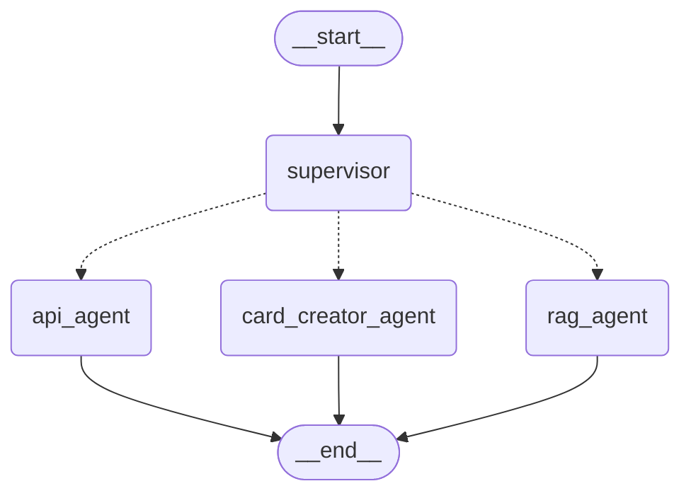

# Arquitectura de la demo

---

## Visión general

Para desarrollar la demo (PoC) he tomado la decisión de simplificar la implementación y en lugar de dividir los módulos en distintos ficheros generar un único py (con la función main) y separar los distintos servicios mediante comentarios. De esta forma, la lectura y el mantenimiento del código se simplifica. 

Inicialmente cargamos las librerías necesarias, a continuación tenemos la configuración de la PoC (variables, paths, prompts, ...) que pueden ser modificados para ejecutar el programa con distintos parámetros (por ejemplo con una actualización del manual del juego). La API Key para el uso del modelo LLM se lee mediante una variable de entorno.

## Arquitectura de la solución

Para implementar el chatbot la arquitectura elegida es la de un sistema de IA multiagente con un agente supervisor (que enruta la petición de la pregunta del usuario) y tres agentes especializados que realizan cada una de las tareas requeridas. El usuario interactúa con el agente supervisor, éste detecta la intención de la pregunta (normas del juego, información de las cartas o creación de una nueva carta), envía la pregunta al agente encargado de la tarea, y éste emplerá sus herramientas para responder a la pregunta, que se le devoilverá al agente supervisor y éste ofrecerá la respuesta al usuario.

Se ha empleado Python (v.3.14) para la implemetación y a continuación se enumeran las principales decisiones de diseño, teniendo en cuante que todo lo empleado, incluidos los modelos, son de acceso gratuito:

- Para el desasrrollo de los agentes se emplea el framework LangGraph.
- El sistema RAG para interrogar al manual del usuario también está basado en herramientas de LangGraph. El chunking del ducumento se realiza con LangGraph, los embeddings se calculan mediante un modelo de HuggingFace que es necesario descargar para poder emplearlo (sentence-transformers/all-MiniLM-L6-v2), y los índices generados se almacenan en la base de datos vectorial FAISS. Los ídices se almancenan en el directorio ./index.
- Las herramientas se han implementado para que sean compatibles con los agentes de LangGraph.
- Cada agente es un grafo, y a partir de todos esos grafos se genera la solución final añadiendo los vértices necesarios (ver Figura).
- Al modelo LLM se accede a través de Groq, que ofrece una versión gratuita y permite generar una API Key para hacer las llamadas (llama-3.3-70b-versatile). Este mdelo open source tiene limitaciones pero tiene la capacidad necesaria para alcanzas los objetivos de la demo.    

En la siguiente Figura podemos ver la representación en forma de grafo del sistema multiagente:

Y en la siguiente tabla una breve descripción de cada uno de los agentes:

| Agente | Requerimiento que cubre | Tools |
|---|---|---|
| `rag_agent` | Reglas básicas + interacciones entre cartas | `search_mtg_rules` (RAG sobre el reglamento) |
| `api_agent` | Búsqueda de cartas por descripción, novedades | `search_cards`, `get_card_by_name`, `get_recent_sets` (API magicthegathering.io) |
| `card_creator_agent` | (Bonus) Creación de cartas custom | `search_cards`, `get_card_by_name` (como referencia de balance) |

Una decisión de diseño fue no usar MCP, todas las tools son funciones Python estándar decoradas con `@tool` (API) o un retriever de documentación (RAG) implementado mediante la función `create_retriever_tool`, ambos mecanismos nativos de LangGraph. MCP habría añadido una excesiva complejidad a la demo

### Principales decisiones del diseño

- **Groq como LLM**: Modelo por defecto: `llama-3.3-70b-versatile` (configurable con la variable de   entorno `GROQ_MODEL`).
- **Embeddings locales**: Se usa un modelo local de HuggingFace
  (`sentence-transformers`).
- **Grounding obligatorio**: El prompt del `rag_agent` obliga a llamar
  siempre a `search_mtg_rules` antes de responder y a citar el fragmento
  del reglamento usado.

El diseño de un MVP o un producto requeriría una arquitectura que tuviera en cuenta la escalabilidad, la gestión de usuarios, la mejora de los modelos, la seguridad, la monitorización, los procesos de CI/CD, la actualización automática de ficheros y modelos, el coste, etc ...